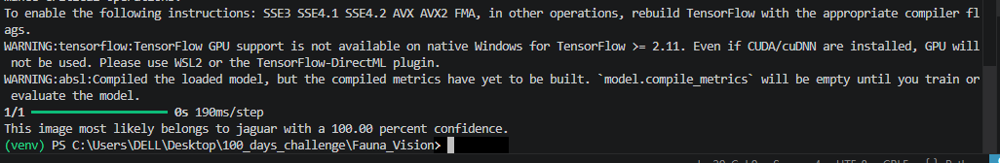

# 🐾 FaunaVision - Animal Detector

Step 1: Project Header & Overview
Start with a clear title and what the project actually does.
- Title: # Fauna Vision 🐾
- Introduction: Fauna Vision is an AI-powered Image Classifier built with TensorFlow and Keras. It is designed to recognize and categorize 6         different types of animals from images.
- "I have developed a Deep Learning model that identifies Anacondas, Jaguars, Toucans, Capybaras, Macaws, and Golden Frogs."

Step 2: The "Brain" (Neural Network) ArchitectureYour code shows a specific structure. Use this section to explain the layers you added:Rescaling: Normalizes image data to a $1./255$ range for faster learning.
- Convolutional Layers (Conv2D): These act as "filters" that detect patterns like eyes, ears, or fur in the animal photos.
- Max Pooling: Reduces the image size to help the model focus only on the most important features.
- Dense Layer: The final decision-making layer that classifies the image into one of 6 animal categories using the softmax activation function.

Step 3: Tech Stack & Files
List the technologies you used so others know what to install.
- Language: Python
- Library: TensorFlow / Keras
- Model Format: .h5 (Saved as fauna_model.h5)
- Environment: Virtual Environment (venv) for clean package management.

Step 4: Project Structure
Since your file explorer shows many files, help the user navigate:
- data/: Contains the training and validation images.
- FaunaVision.py: The main script to train the "brain."
- predict.py: Script to test the model with a new image.
- fauna_model.h5: The pre-trained AI model file.

Step 5: How to Run the Project
Provide a step-by-step guide for someone who downloads your project:
- Activate Environment: .\venv\Scripts\activate
- Train the Model: Run python FaunaVision.py. This script will train for 30 epochs as seen in your code.
- Check Results: Look for the accuracy score in your terminal to see how well the AI learned.

## Project Result:

"Here is the bulk output screenshot from my model showing predictions for all categories:"

